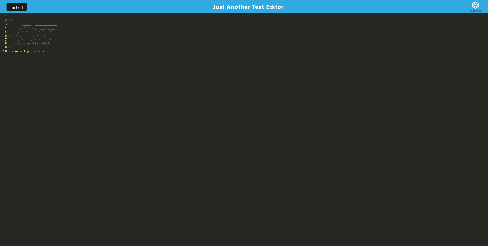

# JATE <a id="readme-top"></a>

## Description

JATE is just another text editor that helps to create and save notes as well as notes with JavaScript syntax highlightned!
Moreover, you can install app on your desktop and keep on adding notes in offline mode! <br/>


## Table of contents

- [Installation](#installation)
- [Usage](#usage)
- [Screenshot](#screenshot)
- [Contribution](#contribution)
- [Questions](#questions)
- [License](#license)

## Installation


- Clone application [JATE](https://github.com/TerryKor/Jate-Text-Editor)<br />

- To install necessary dependencies, run the following command:
```
npm i
```
- After installing necessary dependencies, run the following command:
```
npm start
```
- Once all the above steps are completed, go to http://localhost:3000/ in your browser

## Usage

- See deplpoyed page [here](https://jate-by-terry.herokuapp.com/). Otherwise follow Insatallation instructions<br />

- Also note that you can install Jate app on your desktop to work on your notes in offline mode. Just click `install` button in the top left corner.

## Screenshot



## Contribution

Application was created by Terry Kornienko and if you want to contribute send me an email.<br />

## Questions

My Email:
[misterfreemann@gmail.com](mailto:misterfreemann@gmail.com)
My Github:
[TerryKor](https://github.com/TerryKor)

## License


<p align="right"><a href="#readme-top">back to top</a></p>
